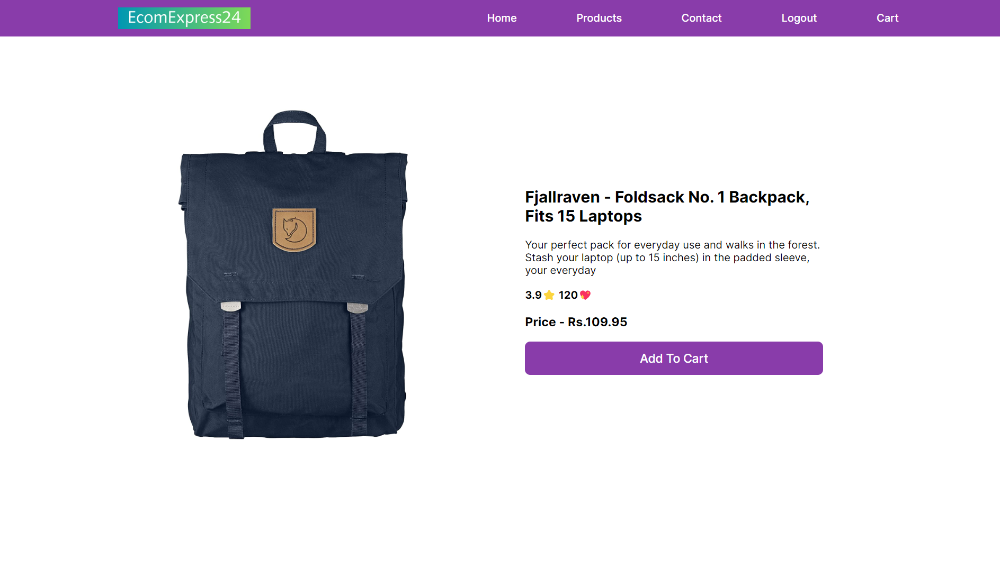

# React + Vite

You can access it here --> [EcomExpres24](https://e-com-express24.netlify.app/)

**User Credentials** - 
- *Username* -> `eve.holt@reqres.in`
- *Password* -> `1234`

# EcomExpres24

## Use on your local:
- Fork > clone the repo which is the basic
- After cloning the project locally you need to run a few commands for installation :
    - `npm install`
    - `npm i axios`
    - `npm install react-spinners --save`
- After all, this is to run the project - `npm run dev` 

## Basic e-commerce website with key features:
- Login authentication is required for access to Product and Cart pages.
- After logging in, users are redirected to the Home page.

## Home page:
- Users can explore the latest collections.
- Users can click on an image or title to be redirected to the specific product details page.

## Product details page:
- User can check the whole details about the product.
- Users can add products to the cart.

## Cart page:
- Displays a list of added products.
- Allows users to select the quantity for each product.
- Updates the total price based on selected quantities.

## Checkout page:
- Shows the final bill.
- Users can fill in details and place their order.

